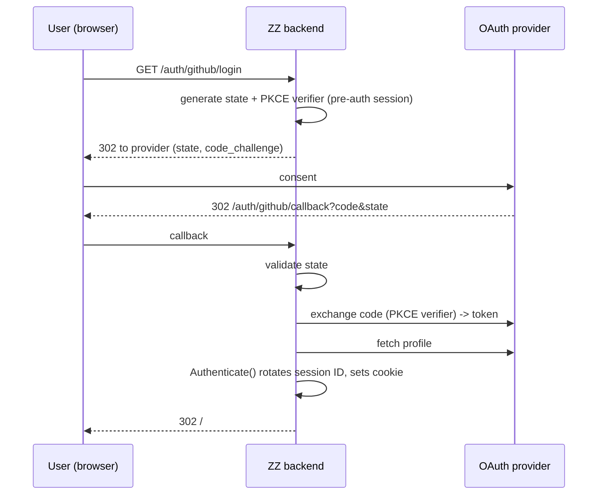
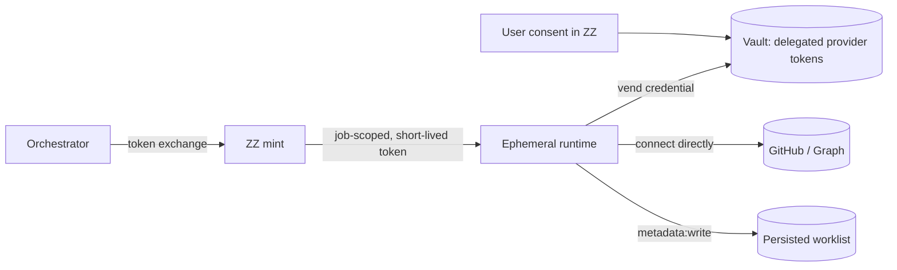

# Architecture

System overview for Zumble-Zay (ZZ). For conventions and invariants see
[../AGENTS.md](../AGENTS.md); for rationale see [adr/](adr/).

## Components

```mermaid
flowchart TB
  subgraph Client
    UI[Landing page / SPA]
  end

  subgraph ZZ[Zumble-Zay backend]
    MW[middleware: recover, log, security headers, CORS]
    AUTHN[authn: RequireAuth / RequireScope]
    OAUTH[auth: OAuth login (GitHub/Google/Microsoft)]
    SESS[session: HMAC cookie sessions]
    WL[worklist: Store + sort]
    ING[Ingestor seam]
    VAULT[(token vault)]
    MINT[token mint / RFC 8693]
    STORE[(persisted worklist - planned)]
  end

  subgraph Agents[Agentic plane - planned]
    ORCH[Orchestrator / spawner]
    RT[Ephemeral agent runtime]
  end

  GH[(GitHub API)]
  GRAPH[(Microsoft Graph: Mail/Teams)]

  UI -->|cookie| MW --> AUTHN
  AUTHN --> WL
  AUTHN --> OAUTH --> SESS
  WL --> STORE
  WL -. empty .-> ING
  ORCH -->|client-secret / SA-OIDC| MINT
  MINT -->|scoped token| RT
  RT -->|bearer| AUTHN
  RT -->|vend credential| VAULT
  RT -->|connect directly| GH
  RT -->|connect directly| GRAPH
  RT -->|write metadata| STORE
```

## Authentication & authorization

Two authentication paths produce one `Principal{Kind, Subject, ActingUserID,
Scopes}` carried in request context. Handlers are agnostic to the path.



Workload path (planned): an `Authorization: Bearer` token is validated by
`authn.TokenValidator`. A presented-but-invalid token yields 401 and never
falls through to the cookie session. `RequireScope` enforces capabilities.

## Agentic identity model



- The orchestrator (durable identity) requests a credential for each spawned
  runtime. ZZ mints `orchestrator authority ∩ user consent ∩ runtime policy`
  as a short-lived, self-describing token.
- Runtimes **connect to providers directly** using a short-lived credential
  **vended by ZZ on demand** from the vault; ZZ never proxies provider data
  (ADR 0006). The vault is the durable holder — a runtime holds the credential
  only for its job.

## Data model (worklist)

- `WorkItem`: GitHub identity (`GitHubRef`) + ZZ `Metadata`
  (priority, relevance, impact, rank, origin, rationale).
- Ordering depends on ZZ metadata, so sorting is **server-side**. Adding a sort
  is a `SortKey` constant + one comparator (`internal/worklist/sort.go`).
- `Store` (owner-scoped) and `Ingestor` (idempotent backfill) are interfaces;
  in-memory / no-op defaults are placeholders for the cloud store and the
  serialized agentic flow.

## Render vs. ingestion

The landing page render path reads persisted ZZ data only — it does not call
GitHub. GitHub/Graph retrieval is **ingestion**, performed asynchronously by
agent runtimes and written into ZZ. This decouples page latency from upstream
APIs and rate limits. See [adr/0004-render-reads-persisted-zz.md](adr/0004-render-reads-persisted-zz.md).

## Deployment

Distroless, non-root, static container; kustomize `base` (TLS Ingress,
`COOKIE_SECURE=true`) and a `dev` overlay (no Ingress, port-forward,
`COOKIE_SECURE=false`). `replicas: 1` until shared session/worklist stores
exist. `make dev-up` builds from source and stands up a kind cluster.
